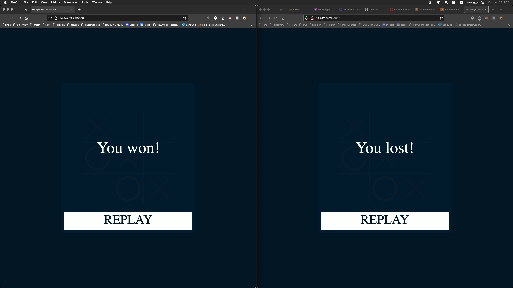
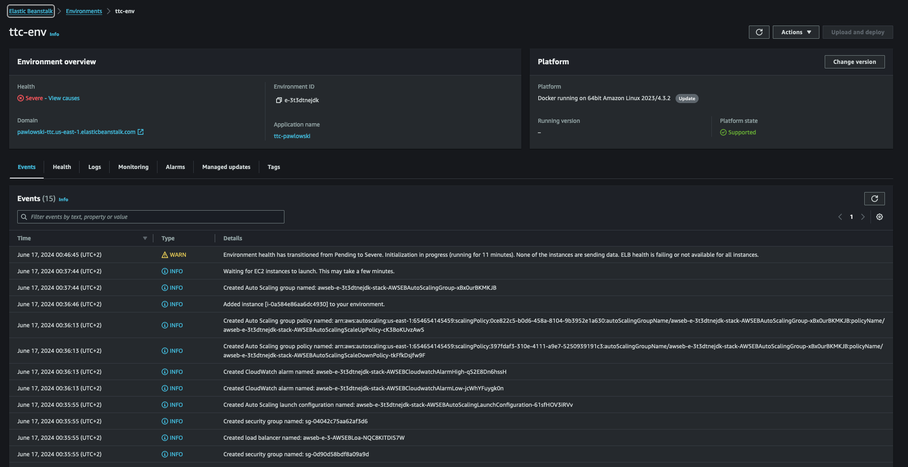
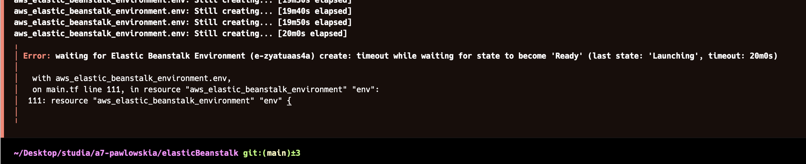

# Adam Pawłowski - Terraform, EC2, TicTacToe report

- Course: *Cloud programming*
- Group: Pon 9:15
- Date: 17.06.2024 r.

## Environment architecture

### 1. Wstęp
W ramach niniejszego projektu został stworzony zestaw zasobów w infrastrukturze chmurowej AWS przy użyciu narzędzia Terraform. Celem projektu było stworzenie środowiska dla aplikacji uruchamianej w Elastic Beanstalk, z wykorzystaniem różnych zasobów AWS takich jak VPC, subnety, brama internetowa, tabele routingu, grupa zabezpieczeń, aplikacja Elastic Beanstalk, środowisko Elastic Beanstalk, S3 oraz inne.

### 2. Konfiguracja dostawcy
W pierwszym kroku zdefiniowany został dostawca usług chmurowych, czyli AWS, z regionem `us-east-1`.

```hcl
provider "aws" {
  region = "us-east-1"
}
```

### 3. Tworzenie sieci VPC
Została utworzona sieć VPC o nazwie `my_vpc` z blokiem adresów CIDR `10.0.0.0/16`, z włączonym wsparciem dla DNS oraz nazw hostów DNS.

```hcl
resource "aws_vpc" "my_vpc" {
  cidr_block = "10.0.0.0/16"
  enable_dns_support = true
  enable_dns_hostnames = true

  tags = {
    Name = "my_vpc"
  }
}
```

### 4. Tworzenie subnetów
Utworzono dwa subnety:
- `public_subnet` z blokiem adresów CIDR `10.0.101.0/24` w strefie dostępności `us-east-1a`, który mapuje publiczne adresy IP na uruchomieniu.
- `private_subnet` z blokiem adresów CIDR `10.0.102.0/24` w strefie dostępności `us-east-1b`.

```hcl
resource "aws_subnet" "public_subnet" {
  vpc_id = aws_vpc.my_vpc.id
  cidr_block = "10.0.101.0/24"
  map_public_ip_on_launch = true
  availability_zone = "us-east-1a"
  
  tags = {
    Name = "public_subnet"
  }
}

resource "aws_subnet" "private_subnet" {
  vpc_id = aws_vpc.my_vpc.id
  cidr_block = "10.0.102.0/24"
  availability_zone = "us-east-1b"
  
  tags = {
    Name = "private_subnet"
  }
}
```

### 5. Tworzenie bramy internetowej
Utworzono bramę internetową `my_igw` i przypisano ją do VPC.

```hcl
resource "aws_internet_gateway" "igw" {
  vpc_id = aws_vpc.my_vpc.id
  
  tags = {
    name = "my_igw"
  }
}
```

### 6. Tworzenie tabeli routingu
Utworzono tabelę routingu `public_route_table`, która przekierowuje cały ruch (`0.0.0.0/0`) do bramy internetowej.

```hcl
resource "aws_route_table" "public_route_table" {
  vpc_id = aws_vpc.my_vpc.id

  route {
    cidr_block = "0.0.0.0/0"
    gateway_id = aws_internet_gateway.igw.id
  }

  tags = {
    Name = "public_route_table"
  }
}
```

### 7. Przypisanie tabeli routingu do subnetu
Przypisano tabelę routingu `public_route_table` do subnetu `public_subnet`.

```hcl
resource "aws_route_table_association" "public" {
  subnet_id = aws_subnet.public_subnet.id
  route_table_id = aws_route_table.public_route_table.id
}
```

### 8. Tworzenie grupy zabezpieczeń
Utworzono grupę zabezpieczeń `server_sg`, która zezwala na ruch HTTP na portach 3000 i 8080 oraz na ruch SSH na porcie 22, a także na cały ruch wychodzący.

```hcl
resource "aws_security_group" "server_sg" {
  name = "server_security"
  description = "allow ssh, http traffic"
  vpc_id = aws_vpc.my_vpc.id

  ingress {
    description = "HTTP Backend"
    from_port = 3000
    to_port = 3000
    protocol = "tcp"
    cidr_blocks = ["0.0.0.0/0"]
  }
  ingress {
    description = "HTTP Frontend"
    from_port = 8080
    to_port = 8080
    protocol = "tcp"
    cidr_blocks = ["0.0.0.0/0"]
  }
  ingress {
    description = "SSH"
    from_port = 22
    to_port = 22
    protocol = "tcp"
    cidr_blocks = ["0.0.0.0/0"]
  }
  egress {
    from_port = 0
    to_port = 0
    protocol = "-1"
    cidr_blocks = ["0.0.0.0/0"]
  }

  tags = {
    Name = "sg"
  }
}
```

### 9. Tworzenie aplikacji Elastic Beanstalk
Utworzono aplikację Elastic Beanstalk o nazwie `ttc-pawlowski`.

```hcl
resource "aws_elastic_beanstalk_application" "app" {
  name = "ttc-pawlowski"
  description = "Tic Tac Toe app using Elastic Beanstalk"
}
```

### 10. Tworzenie środowiska Elastic Beanstalk
Utworzono środowisko Elastic Beanstalk `ttc-env` dla aplikacji `ttc-pawlowski`, z ustawieniami dla VPC, subnetów, grupy zabezpieczeń, oraz innymi specyficznymi dla środowiska.

```hcl
resource "aws_elastic_beanstalk_environment" "env" {
  name = "ttc-env"
  application = aws_elastic_beanstalk_application.app.name
  solution_stack_name = "64bit Amazon Linux 2023 v4.3.2 running Docker"
  version_label = aws_elastic_beanstalk_application_version.version.name
  cname_prefix = "pawlowski-ttc"

  setting {
    namespace = "aws:ec2:vpc"
    name = "VPCId"
    value = aws_vpc.my_vpc.id
  }

  setting {
    namespace = "aws:autoscaling:launchconfiguration"
    name = "IamInstanceProfile"
    value = "LabInstanceProfile"
  }

  setting {
    namespace = "aws:ec2:vpc"
    name = "Subnets"
    value = join(",", [aws_subnet.public_subnet.id, aws_subnet.private_subnet.id])
  }

  setting {
    namespace = "aws:ec2:vpc"
    name = "AssociatePublicIpAddress"
    value = "true"
  }

  setting {
    namespace = "aws:autoscaling:launchconfiguration"
    name = "SecurityGroups"
    value = aws_security_group.server_sg.id
  }

  setting {
    namespace = "aws:elasticbeanstalk:environment"
    name = "EnvironmentType"
    value = "LoadBalanced"
  }

  setting {
    namespace = "aws:elasticbeanstalk:environment"
    name = "ServiceRole"
    value = "arn:aws:iam::654654145459:role/LabRole"
  }

  setting {
    namespace = "aws:ec2:instances"
    name = "SupportedArchitectures"
    value = "x86_64"
  }

  setting {
    namespace = "aws:autoscaling:launchconfiguration"
    name = "InstanceType"
    value = "t2.small"
  }
}
```

### 11. Tworzenie zasobów S3
Utworzono bucket S3 `pawlowski-ttc` oraz obiekt `appcompose.zip`, który został umieszczony w bucket.

```hcl
resource "aws_s3_bucket" "app_bucket" {
  bucket = "pawlowski-ttc"
}

resource "aws_s3_object" "app_s3o" {
  bucket = aws_s3_bucket.app_bucket.bucket
  key = "appcompose.zip"
  source = "appcompose.zip"
}
```

### 12. Wersja aplikacji Elastic Beanstalk
Utworzono wersję aplikacji Elastic Beanstalk `v1`, która wskazuje na bucket `pawlowski-ttc` oraz obiekt `appcompose.zip`.

```hcl
resource "aws_elastic_beanstalk_application_version" "version" {
  name = "v1"
  application = aws_elastic_beanstalk_application.app.name
  description = "Initial version"

  bucket = aws_s3_bucket.app_bucket.bucket
  key = aws_s3_object.app_s3o.key
}
```

### 13. Podsumowanie
Wdrożenie infrastruktury AWS obejmowało tworzenie sieci VPC, subnetów, bramy internetowej, tabel routingu, grupy zabezpieczeń, aplikacji i środowiska Elastic

 Beanstalk, a także bucketu i obiektu w S3. Wszystkie zasoby zostały skonfigurowane i wdrożone przy użyciu narzędzia Terraform, co pozwala na łatwe zarządzanie i skalowanie infrastruktury w przyszłości.

## Preview

Screenshots of configured AWS services. Screenshots of your application running.




## Reflections

- What did you learn?
  
Nauczyłem się jak tworzyć infrastrukturę Elastic Beanstalk w AWS przy użyciu Terraform.
### What obstacles did you overcome?
  
- **Problem 1**: zły sposób zipowania plików. Poprawnym sposobem jest zipowanie plików wewnątrz folderu, a nie samego folderu.
- **Problem 2**: wybór odpowiedniej platformy. Dzięki sugestii prowadzącego, Amazon Linux 2023 v4.3.2 running Docker, a nie Amazon Linux 2 pozwolił mi na uruchomienie aplikacji.
- **Problem 3**: budowanie obrazu na lokalnej maszynie. W pewnym momencie, zacząłem budować obraz na swoim laptopie, a nie na Cloud9. Moja maszyna to macbook z procesorem M1, a nie x86_64, co sprawiło, że obraz nie działał na Elastic Beanstalk. Rozwiązaniem było zbudowanie obrazu na Cloud9 i zpushowanie go do AWS ECR. Najgorszym aspektem tego błędu było to, ze zła archiutektura pomimo iz jest wykrywana, to nie pokazuje się jako `ERROR`, ani nawet `WARNING`, a jedynie jako `INFO`.
Niestety komunikaty z terraforma i na AWS wyglądały tak:

Więc dopiero z pomocą prowadzącego udało mi się zlokalizować problem.
- **Problem 4**: brak komunikacji pomiędzy backendem a frontendem. W aplikacji TicTacToe, backend i frontend nie komunikowały się ze sobą. Rozwiązałem ten problem uywając skryptu to odnajdywania ip instancji ec2, zapewnionego przez prowadzącego.
- **Problem 5**: bardzo długi czas deployowania aplikacji **tuz po stacie labu**. W pewnym momencie, deployowanie aplikacji trwało bardzo długo, ponad 20 minut.

Rozwiązaniem było nie startowanie aplikacji jako zrobienie pierwszej rzeczy po zalogowaniu się do labu. Moja teoria jest taka, ze jakaś usługa się jeszcze nie załadowała, i przez to pierwszy deploy trwał tak długo. Po zrobieniu czegoś innego, a dopiero potem deployowaniu, czas deployowania zmalał do około 5 minut.
### What did you help most in overcoming obstacles?
Konsultacje z prowadzącym oraz dokumentacja AWS.
### Was that something that surprised you?
Tak, zaskoczyło mnie to, że błędna architektura obrazu nie zawsze są wykrywane jako `ERROR` lub `WARNING`, co sprawia, że trudno jest zlokalizować problem.
